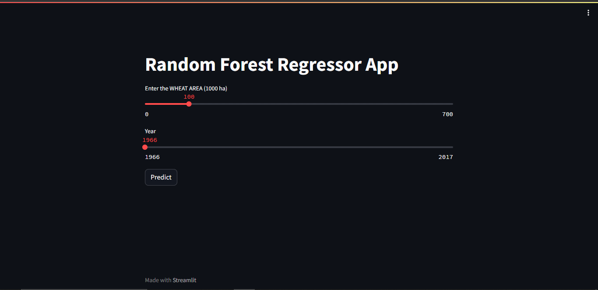
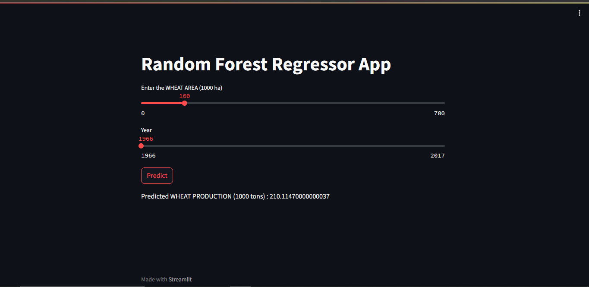

# MLHDataHackathon

## Description

This project was developed by Aman Badone, for the purpose of just a fun hackathon event conducted by MLH during October 13-15.Based upon the theme of "Data".And ultimately Predicts Agricultural Produce nased upon area and year as the features

## Table of Contents

- [Installation](#installation)
- [Usage](#usage)
- [Features](#features)
- [Demonstration](#demonstration)
- [Contributing](#contributing)
- [License](#license)

## Installation

These are the following dependencies to run the project make sure all of this is done before running the project
(Personal Recommendation : Prefer Using Google Colab as it will be faster and easier)

```bash
pip install numpy pandas matplotlib
pip install scikit-learn tensorflow
pip install streamlit pyngrok
```

## Usage

The aim of this ML model is to analyze the trends of year wise wheat production vs wheat sowing area as per the given units in the dataset.
The dataset used is obtained from ICRISAT To learn more about it refer http://data.icrisat.org/dld/index.html

The District Level Database (DLD) for Indian agriculture and allied sectors provides a comprehensive one-stop shop for data on rural sector that enables testing of key research hypotheses, identification of relevant districts / regions for technology dissemination, promoting rural pro-poor programs / development initiatives and identification of relevant representative districts for micro level assessment.

### Data Preprocessing

```python
import numpy as np
import pandas as pd
import matplotlib.pyplot as plt

# Data preprocessing code here...
```

### Linear Regression

```python
from sklearn.linear_model import LinearRegression
from sklearn.metrics import r2_score

# Linear regression code here...
```

### Random Forest Regressor

```python
from sklearn.ensemble import RandomForestRegressor
from sklearn.model_selection import train_test_split
from sklearn.metrics import mean_squared_error

# Random Forest code here...
```

### Streamlit App

```bash
streamlit run app.py
```

### Neural Network (Experimental)

```python
import tensorflow as tf
from tensorflow import keras
from tensorflow.keras import layers

# Neural network code here...
```

## Features

Predicts Agricultural Produce
Using the important trend for how the production of wheat is obviously very closely related to the sowing area. we were able to predict it for future more years
and not just that we can extend this model with various other features such as agricultural gdp by WHO Dataset, yearly prices per unit of many of such crop.
This particular data that i used was for my hometown Shujalpur and all of you are welcomed to modify it use it and have fun.

## Demonstration

Before


After



## Contributing

Well I am thinking to maybe sew or merge some other sort of data as in a feature list so that we can have more accurate reaults

## License

This project is licensed under the [MIT License](LICENSE).

---

Feel free to customize this template to suit your specific project. Make sure to replace placeholders with actual content. Good luck with your project!
